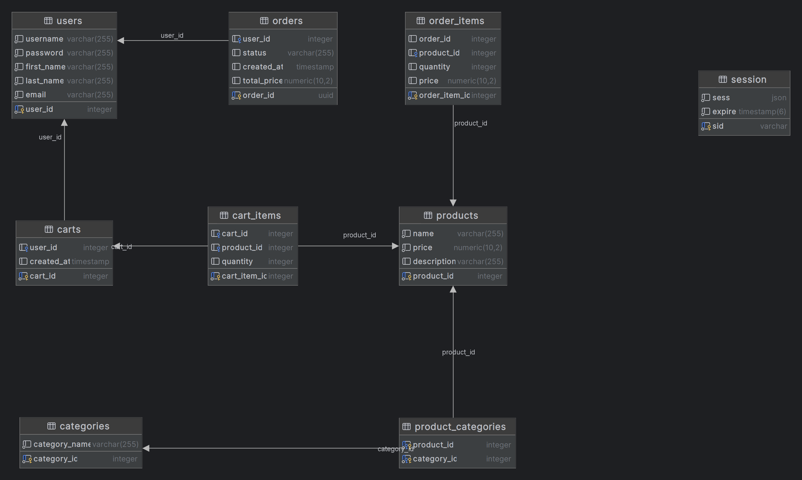

E-Commerce API Shop - Project
===

Abstract: A REST API for online e-commerce system

## Usage

- Install Dependencies

  ```
  npm install
  ```

- Run App

  ```
  npm start
  ```

## Technology Stack

- Node js
- Express Js
- PostgreSQL
- Redis

## Entity Relationship Diagram

<div align="center">
  
</div>

## Routes available

base url: `localhost:3000/api`

- User

| Routes | Method | Test Data | Description |
| ---     | :---:   | ---   |---   |
| /users/register | POST |  "username": "test",    "password": "123456",    "first_name": "v",    "last_name": "a",    "email": "<test@test.com>" |For creating new user account. Adding all given information to users table. |
| /users | GET|  |Get all users |
| /users/:userId| GET |  |Get user by ID |
| /users/:userId| PUT | "username": "test1",    "password": "123456",    "first_name": "v",    "last_name": "a",    "email": "<test@test.com>" |Update user by details |
| /users/:userId| DELETE |  |Remove user from db |

- AUTH

| Routes | Method | Test Data | Description |
| ---     | :---:   | ---   |---   |
| /auth/login | POST |  "email": "<test@1.com>", "password": "123456" |For loging users in, comparing their email and password with exists db. If correct authenticating the user with Express Session. |
| /auth/login | GET|  | For logging the user out |

## Directory Hierarchy

```
|—— .env
|—— .gitignore
|—— config
|    |—— passportConfig.js
|—— controller
|    |—— authController.js
|    |—— cartController.js
|    |—— categoryController.js
|    |—— orderController.js
|    |—— productController.js
|    |—— userController.js
|—— CRUD.js
|—— db
|    |—— db.js
|    |—— db.sql
|    |—— index.js
|    |—— user_queries.js
|—— models
|    |—— cartItemModel.js
|    |—— cartModel.js
|    |—— categoryModel.js
|    |—— orderItemModel.js
|    |—— orderModel.js
|    |—— productModel.js
|    |—— userModel.js
|—— node_modules
|—— package-lock.json
|—— package.json
|—— routes
|    |—— authRoutes.js
|    |—— cartRoutes.js
|    |—— categoryRoutes.js
|    |—— dashboardRoutes.js
|    |—— orderRoutes.js
|    |—— productRoutes.js
|    |—— userRoutes.js
|—— server.js
|—— sessions
|    |—— eN3jGCW_3ZtHnpNjQDpkR--dLcv5FDvy.json
|—— views
|    |—— login.ejs
```
