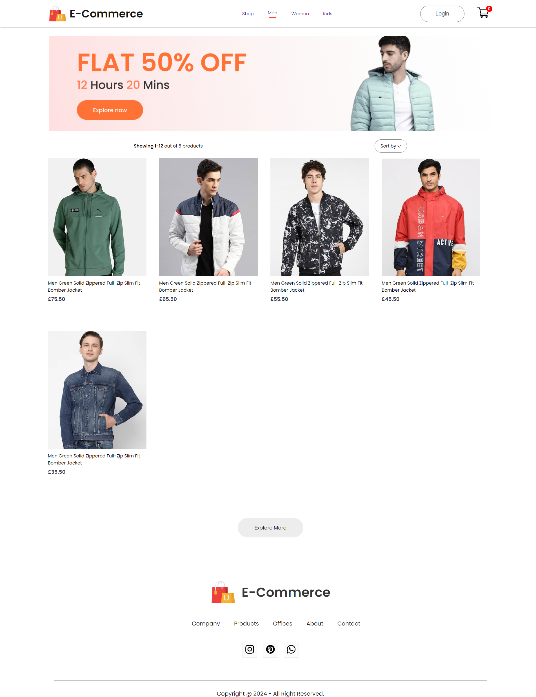
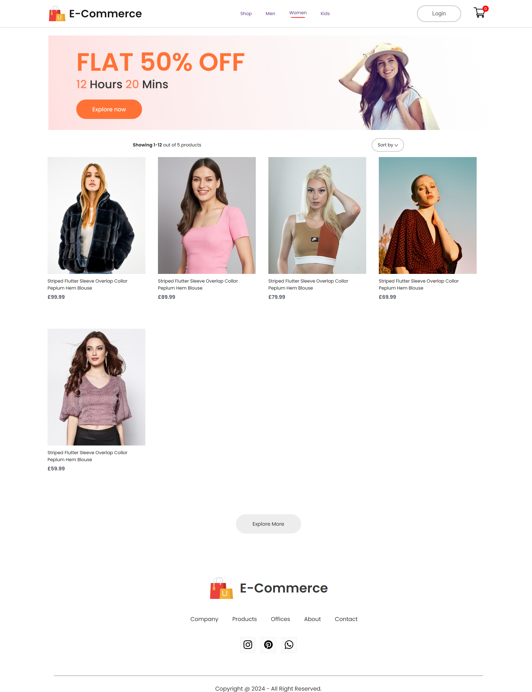
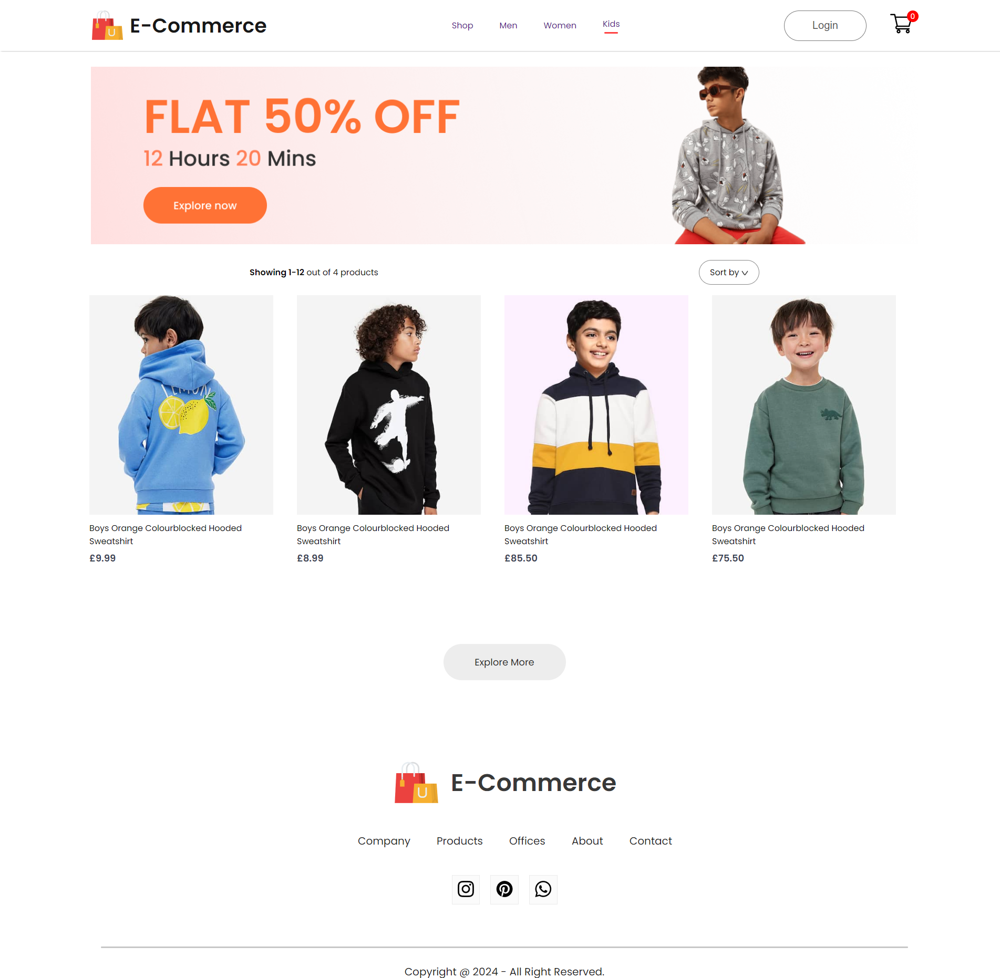

E-Commerce Frontend
===
Abstract: E-Commerce App made from scratch using PERN Stack

## 
- Install Dependencies
  ```
  npm install
  ```
- Run App
  ```
  npm start
  ```

##### Home page


#### Men page


#### Women page


#### Kids page


## Directory Hierarchy
```
|—— .gitignore
|—— node_modules
|—— package-lock.json
|—— package.json
|—— public
|    |—— favicon.ico
|    |—— index.html
|    |—— robots.txt
|—— src
|    |—— api.js
|    |—— api_Woman.js
|    |—— App.css
|    |—— App.js
|    |—— Components
|        |—— Assets|           
|        |—— ErrorBoundary.js
|        |—— Footer
|            |—— Footer.css
|            |—— Footer.jsx
|        |—— Hero
|            |—— Hero.css
|            |—— Hero.jsx
|        |—— Item
|            |—— Item.css
|            |—— Item.jsx
|        |—— Navbar
|            |—— Navbar.css
|            |—— Navbar.jsx
|        |—— NewCollections
|            |—— NewCollections.css
|            |—— NewCollections.jsx
|        |—— NewsLetter
|            |—— NewsLetter.css
|            |—— NewsLetter.jsx
|        |—— Offers
|            |—— Offers.css
|            |—— Offers.jsx
|        |—— Popular
|            |—— Popular.css
|            |—— Popular.jsx
|    |—— Context
|        |—— ShopContext.jsx
|    |—— index.css
|    |—— index.js
|    |—— Pages
|        |—— Cart.jsx
|        |—— CSS
|            |—— ShopCategory.css
|        |—— LoginSigunup.jsx
|        |—— Product.jsx
|        |—— Shop.jsx
|        |—— ShopCategory.jsx
```
